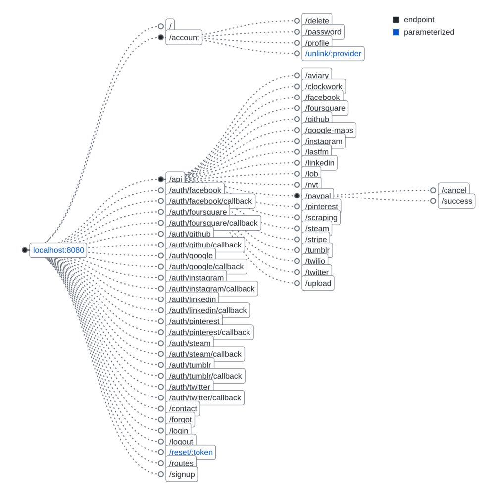
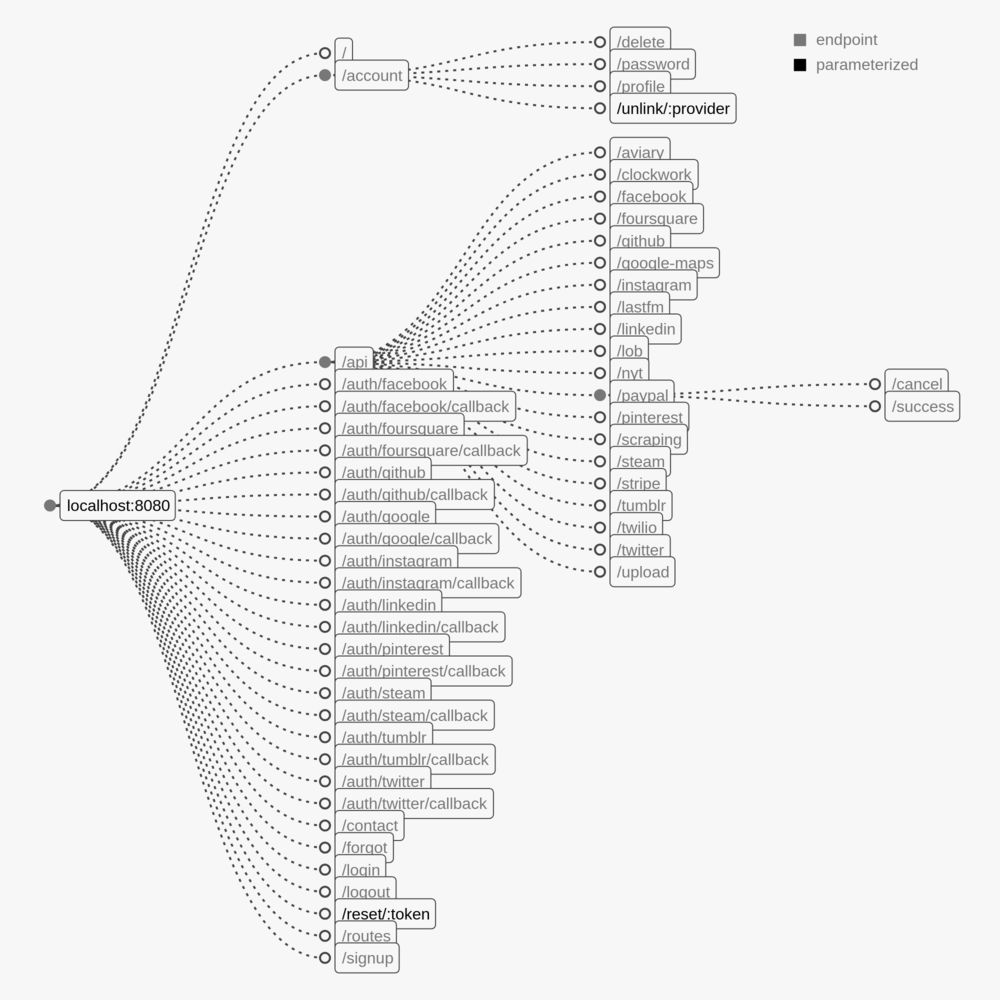
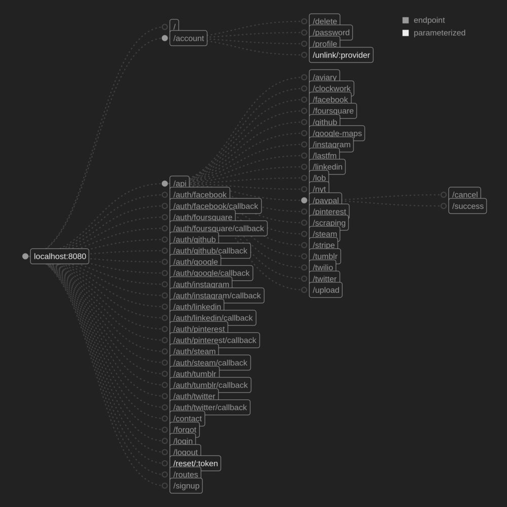
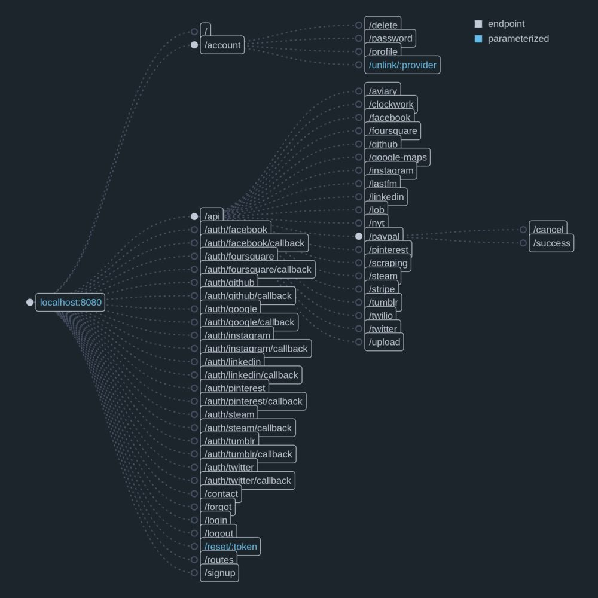
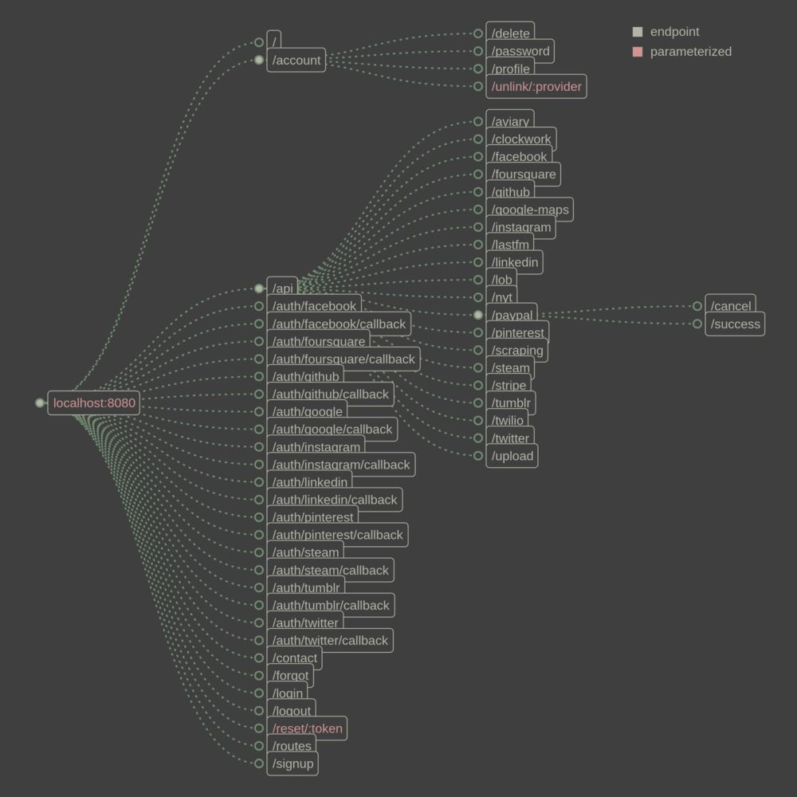

# Themes

## `plain`

A plain scheme with a light background

## `light-gray`

A simple light grayscale theme

## `dark-gray`

A simple dark grayscale theme

## `dark-blue`

A darker blue theme loosely based on the Atom Nord theme

## `burn`

A low-contrast scheme inspired by Zenburn

